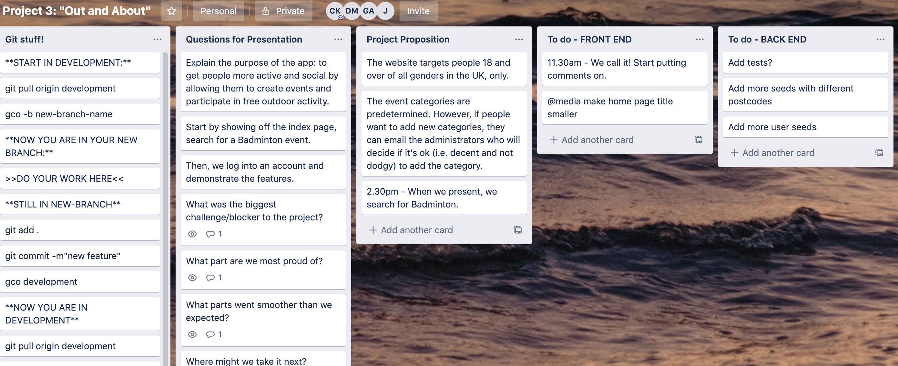
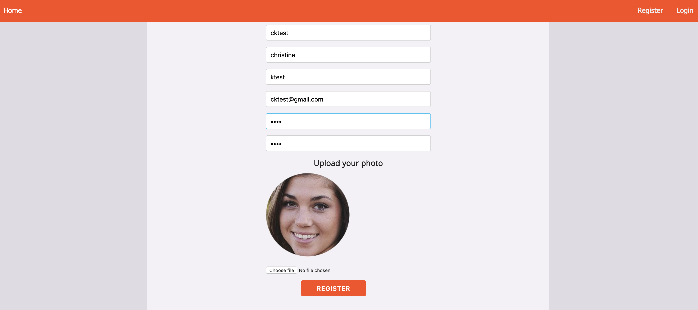
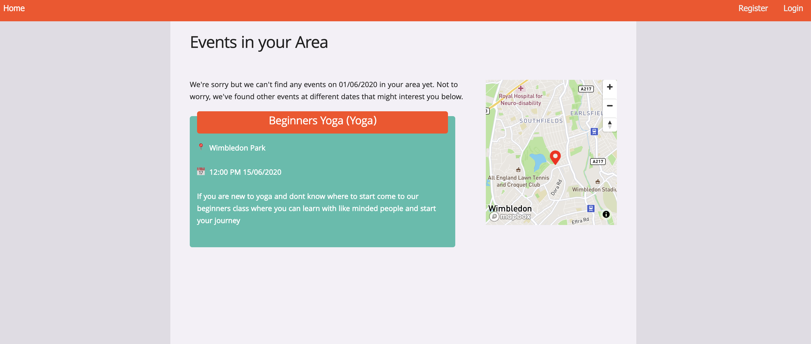
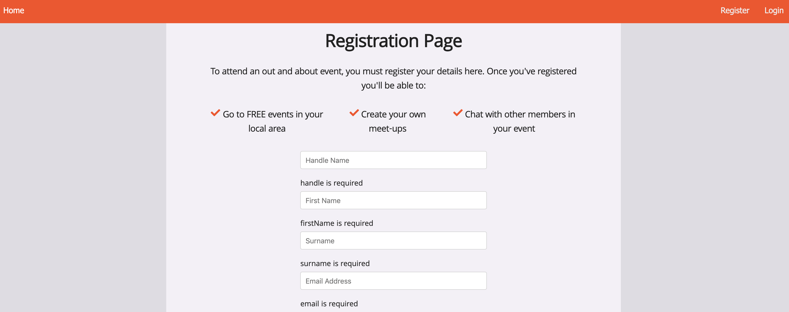
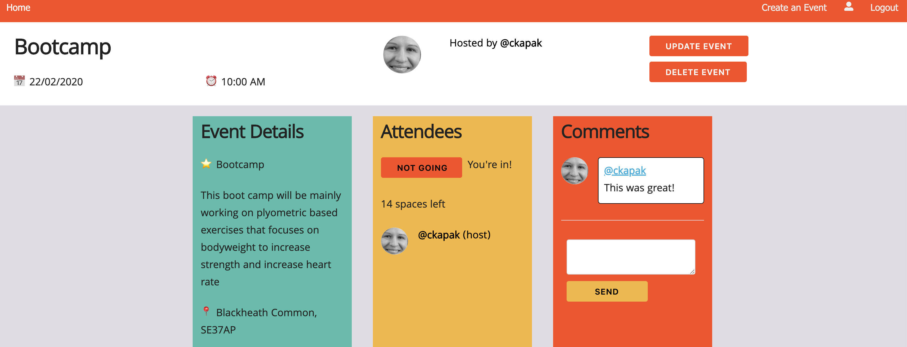

# Out and About Project
​
## Overview

This was my third project (built in a group) on the Software Engineering Immersive course at General Assembly.

**Out And About** is an app that allows users to search for free outdoor events in London by entering the postcode of the area they wish to visit, the date, time and the event category. ​Once the user registers and logs in, they can join an event, view past/upcoming/future events on their profile page, add comments on the event board and create their own event. 

## Teammates

* Dide: https://github.com/didemertens
* George: https://github.com/georgeanthony33
* Jesse: https://github.com/Jesse2889 
​
## Brief

To plan, build, style and test a full-stack MERN application in one week. This must incorporate a React frontend that communicates with our backend Express API built with MongoDB. There must be unit tests for at least one RESTful resource on the back-end.

## Technologies
​
The app was built with:
​
* React
* Express
* Node.js
* MongoDB
* Skeleton CSS
* Sass
* Axios
* Bulma
* Git
* GitHub
​
## Deployment

This application was deployed on Heroku at https://out-about-events.herokuapp.com/ 

## Getting started

Use the clone button to download the source code. Run the following commands in the terminal:

```
<!-- To install all the packages listed in the package.json: -->
$ yarn

<!-- Run the app in your localhost: -->
$ yarn start:front
$ yarn start:back
```

## Website Architecture

The app is comprised of the following:
Home Page
Index Page

## My Contributions

### Planning
I showed the team how to use Trello to organise and manage the project. Once we discussed the idea for the app, a teammate created wireframes using Figma.




### Image Profile
I created a custom front-end image upload component (using Cloudinary, a cloud-based image and video management service) and imported it into the registeration and user profile pages. 

```
  handleUpload = async ({ target: { files } }) => {
    const data = new FormData
    data.append('file', files[0])
    data.append('upload_preset', 'rskh3gab')
    const res = await axios.post('https://api.cloudinary.com/v1_1/dqwdkxz64/image/upload', data)
    this.setState({ image: res.data.url }, () => {
      this.props.handleChange({ target: { name: this.props.fieldName, value: res.data.url } })
    })
  }
```



I worked together with a team-mate to show a generic default image of a tennis ball if the user decides not to upload a profile image during the registration process. The user has the option to upload an image at a later time. 

```
      if (!response.data.profileImage) {
        const userData = { ...response.data, profileImage: '/../../assets/tennis-ball.png' }
        this.setState({ userData: response.data })
        try {
          await axios.put('/api/profile/update', userData,
            { headers: { Authorization: `Bearer ${FrontAuth.getToken()}` } })
        } catch (err) {
          console.log(err)
        }
```

### Map  
Built together with a team-mate, we used a third-party Mapbox API which shows where the event would be (demonstrated by a marker and popup box with the title of the event) after the user searches for an event. 



### Register & Login Page
I built the register and login pages, with a focus on creating custom error handler messages. 

```
function errorHandler(err, req, res, next) { 
  console.log('error2 is', err)
  if (err.name === 'ValidationError' || err.name === 'MongoError') { 
    const customErrors = {}

    for (const key in err.errors) {
      customErrors[key] = `${key} is required`
    }

    return res.status(422).json({ message: 'Unprocessible Entity', errors: customErrors })
  }

  if (err.message === 'NotFound') {
    return res.status(404).json({ message: 'Not found' })
  }

  if (err.message === 'Unauthorized') {
    return res.status(401).json({ message: 'Invalid details' })
  }

  res.status(500).json({ message: 'Internal Server Error' })
  next(err)

}
```

So, as an example, if the user misses out a required piece of info on the registration form - a user-friendly error message is returned and prompts the user to complete all fields. 



### User Comments

I also added the functionality for users to make comments on the 'show event' page which appears alongside their handle username and profile image: 

```
            <div className="four columns showpage-column-right">
              <h3><strong>Comments</strong></h3>
              {this.state.eventInfo.comments
                ?
                this.state.eventInfo.comments.map(comment => (
                  <div key={comment._id} className="row showpage-div">
                    <Link to={`/profile/${comment.user._id}`}>
                      <div className="three columns">
                        
                      </div>
                    </Link>
                    <div className="nine columns showpage-comment">
                      <Link to={`/profile/${comment.user._id}`}>
                        <p className="showpage-comment"><strong>@{comment.user.handle}</strong></p>
                      </Link>
                      <p className="showpage-comment">{comment.text}</p>
                    </div>
                  </div>
                ))
                :
                <div></div>
              }
```




## Challenges & Future Improvements

We were comfortable using Bulma as a CSS framework for styling previous projects, so we used something new - Skeleton CSS. Unfortunately, due to time constraints, we weren't able to get completely familiar with this framework which meant that the app is not mobile responsive. 
