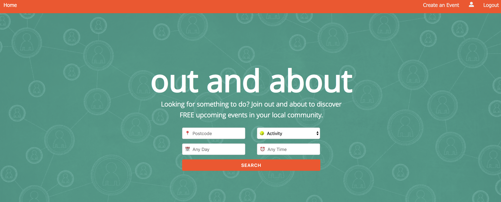
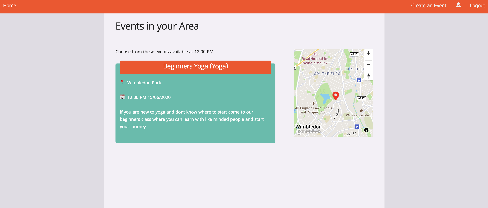
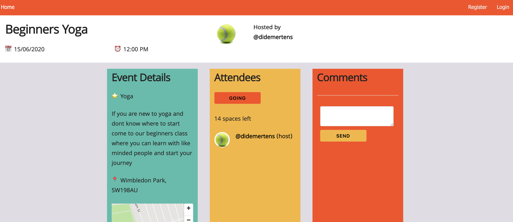
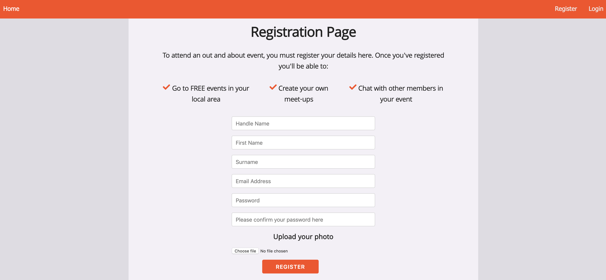
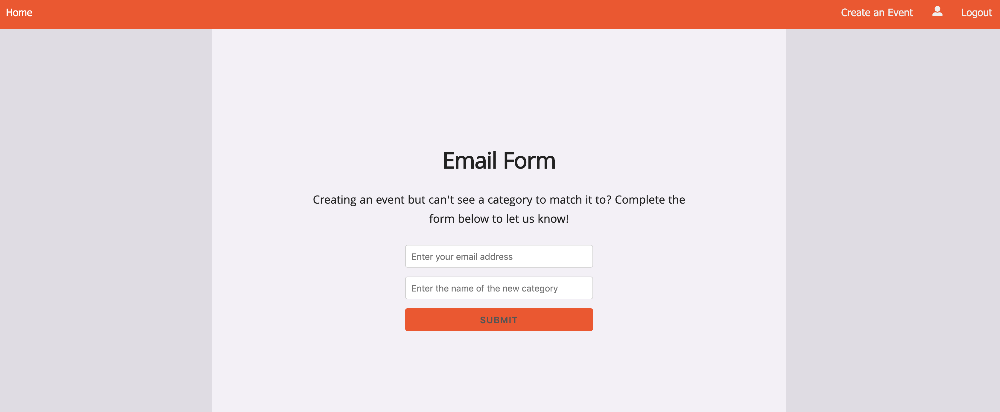
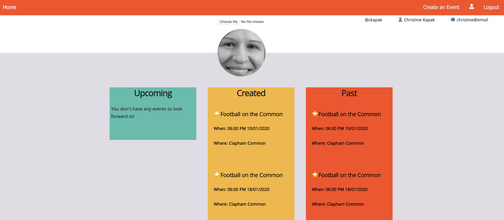
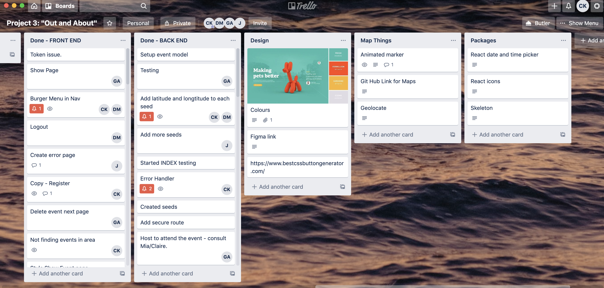
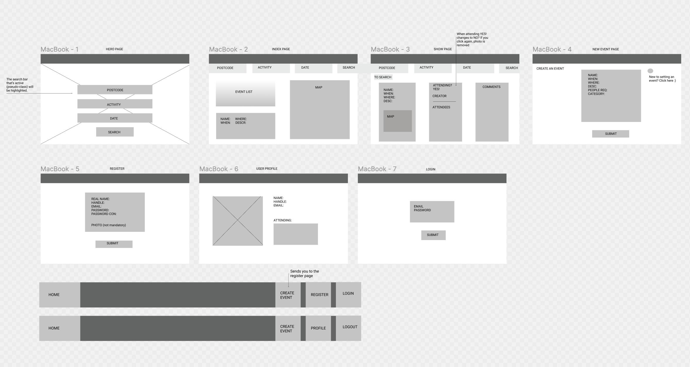

# Out and About Project
​
## Overview

This was my third project (built in a group) on the Software Engineering Immersive course at General Assembly.

**Out And About** is an app that allows users to search for free outdoor events in London by entering the postcode of the area they wish to visit, the date, time and the event category. 

​Once the user registers and logs in, they can join an event, view past/upcoming/future events on their profile page, add comments on the event board and create their own event. 

## Teammates

* Dide: https://github.com/didemertens
* George: https://github.com/georgeanthony33
* Jesse: https://github.com/Jesse2889 
​
## Brief

To plan, build, style and test a full-stack MERN application in one week. This must incorporate a React frontend that communicates with our backend Express API built with MongoDB. There must be unit tests for at least one RESTful resource on the back-end.

## Technologies
​
The app was built with:
​
* React
* Mapbox
* Express
* Node.js
* MongoDB
* Skeleton CSS
* Sass
* Axios
* Bulma
* Git
* GitHub
* Chai
* Mocha
* Cloudinary
* Figma
* Trello

​
## Deployment

This application was deployed on Heroku at https://out-about-events.herokuapp.com/ 

## Getting started

Use the clone button to download the source code. Run the following commands in the terminal:

```
<!-- To install all the packages listed in the package.json: -->
$ yarn

<!-- Run the app in your localhost: -->
$ yarn start:front
$ yarn start:back
```

## Website Architecture

The app is comprised of the following pages:

### Home 
The homepage allows the user to search for an event.  




### Index 
A list of relevant events will appear relating to the user's search. If there isn't anything that fits the user's requirements, then the interface will return alternatives. 



### Event
When the user selects an event from the list, they will see more details.



### Register & Login
The user must register if they want to join an event, create an event or make a comment on the event board. 



### New Event
Once logged in, the user can create an event.  


All categories are predetermined by the admin team. So if the user wishes to add another category, they must signify their interest using our working form.  



### User Profile
Once the user logs in, they'll be able to view their past, created and upcoming events. 



## My Contributions

### Planning
I showed the team how to use Trello to organise and manage the project in an
agile process. We allocated tasks, and moved each one to the appropriate column
(i.e. whether it was 'To Do', 'In Progress' or 'Done). We discussed our progress in daily stand-ups. 



Once we discussed the final idea for the app, I drafted up the wireframes and a teammate transformed them using Figma. 



### Image Profile
I created a custom front-end image upload component (using Cloudinary, a cloud-based image and video management service) and imported it into the registration and user profile pages. 

```
  handleUpload = async ({ target: { files } }) => {
    const data = new FormData
    data.append('file', files[0])
    data.append('upload_preset', 'rskh3gab')
    const res = await axios.post('https://api.cloudinary.com/v1_1/dqwdkxz64/image/upload', data)
    this.setState({ image: res.data.url }, () => {
      this.props.handleChange({ target: { name: this.props.fieldName, value: res.data.url } })
    })
  }
```


I worked with a team-mate to show a generic default image of a tennis ball if the user decided not to upload a profile image during the registration process. The user has the option to upload an image at a later time via their profile page. 

```
      if (!response.data.profileImage) {
        const userData = { ...response.data, profileImage: '/../../assets/tennis-ball.png' }
        this.setState({ userData: response.data })
        try {
          await axios.put('/api/profile/update', userData,
            { headers: { Authorization: `Bearer ${FrontAuth.getToken()}` } })
        } catch (err) {
          console.log(err)
        }
```

### Map  
Built together with a team-mate, we used Mapbox API which shows where the event would be (demonstrated by a marker and popup box with the title of the event) after the user searches for an event. 


### Register & Login Page
I built the register and login pages, with a focus on creating custom error handler messages. 

As an example, if the user misses out a required piece of info on the registration form - the interface returns a user-friendly error message and prompts the user to complete all fields. 

```
function errorHandler(err, req, res, next) { 
  console.log('error2 is', err)
  if (err.name === 'ValidationError' || err.name === 'MongoError') { 
    const customErrors = {}

    for (const key in err.errors) {
      customErrors[key] = `${key} is required`
    }

    return res.status(422).json({ message: 'Unprocessible Entity', errors: customErrors })
  }

  if (err.message === 'NotFound') {
    return res.status(404).json({ message: 'Not found' })
  }

  if (err.message === 'Unauthorized') {
    return res.status(401).json({ message: 'Invalid details' })
  }

  res.status(500).json({ message: 'Internal Server Error' })
  next(err)

}
```


### User Comments

I enabled users (once logged in) to make comments on the event page which appears alongside their handle username and profile image: 

```
            <div className="four columns showpage-column-right">
              <h3><strong>Comments</strong></h3>
              {this.state.eventInfo.comments
                ?
                this.state.eventInfo.comments.map(comment => (
                  <div key={comment._id} className="row showpage-div">
                    <Link to={`/profile/${comment.user._id}`}>
                      <div className="three columns">
                        
                      </div>
                    </Link>
                    <div className="nine columns showpage-comment">
                      <Link to={`/profile/${comment.user._id}`}>
                        <p className="showpage-comment"><strong>@{comment.user.handle}</strong></p>
                      </Link>
                      <p className="showpage-comment">{comment.text}</p>
                    </div>
                  </div>
                ))
                :
                <div></div>
              }
```


## Wins & Key Learnings

Thanks to our meticulous planning, effective communication and an agile mindset, we successfully delivered a fully-functional full-stack app.

From the styling to the choice of project through to problem-solving and styling, we made group decisions and tackled each area collectively. The project definitely taught me how to work as a team and was a great introduction to pair programming.

## Future Improvements

Moving forward: 
* We were comfortable using Bulma as a CSS framework for styling previous projects, so we used something new - Skeleton CSS. Unfortunately, due to time constraints, we weren't able to get completely familiar with this framework which meant that the app is not mobile responsive. 
* In addition to this I would like to add more features to the app, like a weather forecast and a section that shows users which events are coming up in their area. 


